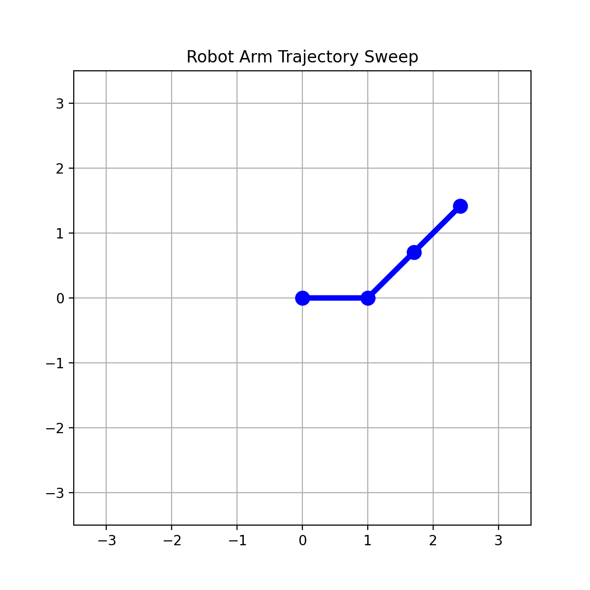

# Dual-Track Kinematics Engine & Dynamic Visualizer Framework
An academic-grade serialization package implementing forward kinematics solvers, spatial $SO(3)$ manifold conversions with singularity handling, hyperspherical trajectory interpolation (SLERP), and real-time wireframe state space visualization.
<p>
  
</p>


---

## 1. Project Overview & Academic Value
In modern robotics research pipelines, engineers must be fluent across two distinct programming domains: prototyping complex analytical algorithms from scratch in highly flexible environments (Python/NumPy) and deploying verified system architectures to physical or co-simulated robotic structures interacting with networks (MATLAB/Simulink/ROS). 

This repository showcases a parallel implementation engineered to bridge these domains:
* **The Python Track (`python_scratch/`):** Built strictly from first principles using raw numerical arrays via NumPy. It implements foundational algebraic transforms, Shepperd's branch selection to eliminate quaternion coordinate mapping singularities, and active numerical domain saturation guards.
* **The MATLAB Track (`matlab_toolbox/`):** Utilizes the optimized **Robotics System Toolbox** and **ROS Toolbox** ecosystems. It handles fast architectural compilation, rigid body frame transformations, and dynamic UI slider polling designed to interface directly with hardware networks or broadcast transformation metrics over `/tf` trees to visualization clients like RViz.

---

## 2. Mathematical Formulations & Geometrical Foundations

### A. The Matrix Exponential & Logarithmic Maps ($SO(3) \rightleftharpoons \mathfrak{so}(3)$)
To translate a continuous axis-angle configuration vector (an element of the Lie Algebra $\mathfrak{so}(3)$ defined by a unit axis vector $\hat{n} \in \mathbb{R}^3, \|\hat{n}\|=1$ and an angle $\theta \in \mathbb{R}$) into an orthogonal rotation matrix (an element of the Lie Group $SO(3)$), we evaluate **Rodrigues' Rotation Formula**:

$$R = I_3 + \sin\theta [\hat{n}]_\times + (1 - \cos\theta) [\hat{n}]_\times^2$$

Where $[\hat{n}]_\times$ represents the skew-symmetric matrix mapping of the 3D vector used to resolve vector cross-products into uniform linear algebra matrix multiplications:

$$[\hat{n}]_\times = \begin{bmatrix} 0 & -n_z & n_y \\ n_z & 0 & -n_x \\ -n_y & n_x & 0 \end{bmatrix}$$

For the inverse mapping (the matrix logarithm), the scalar rotation angle is decoupled from the matrix trace:

$$\theta = \arccos\left(\frac{\text{trace}(R) - 1}{2}\right)$$

#### Defensive Numerical Filtering:
* **Machine Epsilon Boundary Protection ($\theta \to 0$):** Handled via standard limit approximations to protect stability.
* **Antipodal Boundary Singularity ($\theta \to \pi$):** As $\sin(\theta) \to 0$, standard matrix axis extraction triggers a division-by-zero error. The engine resolves this by switching to an alternative mathematical branch extracted from the symmetric component of the manifold $R + I_3 = 2\hat{n}\hat{n}^T$, selecting the dominant diagonal element to maximize numerical safety.
* **Domain Clamping:** Truncation errors in floating-point arithmetic can cause a calculated matrix trace to equal $3.000000000002$, forcing the domain argument of $\arccos(x)$ out of bounds and returning complex numbers or `nan` fields. The engine applies an explicit saturation filter: `val = np.clip((trace_R - 1.0) / 2.0, -1.0, 1.0)`.

### B. Manifold Trajectory Tracking via SLERP
Linear interpolation (LERP) of spatial orientations cuts through the interior of the unit hypersphere, introducing non-uniform angular velocities. To achieve smooth trajectories, **Spherical Linear Interpolation (SLERP)** computes path steps along a great-circle arc directly on the $S^3$ unit quaternion hypersphere:

$$\text{SLERP}(q_0, q_1, t) = \frac{\sin((1-t)\Omega)}{\sin\Omega}q_0 + \frac{\sin(t)\Omega}{\sin\Omega}q_1$$

Where $\cos\Omega = q_0 \cdot q_1$. 
* **Shortest-Path Guard:** Quaternions double-cover the 3D rotation space ($SO(3)$), meaning $q$ and $-q$ represent the exact same physical position. If the dot product $\cos\Omega < 0$, the engine negates $q_1$ ($q_1 \leftarrow -q_1$) to enforce the shortest path, eliminating unintended $270^\circ$ joint whipping.
* **Small Angle Approximation:** If $\cos\Omega \ge 0.9995$, the separation angle is less than $3^\circ$. To prevent a division-by-zero disaster as $\sin\Omega \to 0$, the algorithm safely falls back to standard normalized LERP.

### C. Kinematic Chains (Standard Denavit-Hartenberg)
Multi-body linkage transformation maps are parameterized sequentially using four parameters: link length $a_i$, link twist $\alpha_i$, link offset $d_i$, and joint angle $\theta_i$. The homogeneous local jump transformation matrix $T_i^{i-1}$ is evaluated as:

$$T_i^{i-1} = \begin{bmatrix} \cos\theta_i & -\sin\theta_i\cos\alpha_i & \sin\theta_i\sin\alpha_i & a_i\cos\theta_i \\ \sin\theta_i & \cos\theta_i\cos\alpha_i & -\cos\theta_i\sin\alpha_i & a_i\sin\theta_i \\ 0 & \sin\alpha_i & \cos\alpha_i & d_i \\ 0 & 0 & 0 & 1 \end{bmatrix}$$

The complete forward kinematics solution mapping the joint vector space configuration to the end-effector pose relative to the fixed ground origin is evaluated via post-multiplied transformation matrix chaining:

$$T_n^0(q) = \prod_{i=1}^{n} T_i^{i-1}(q_i) = T_1^0(q_1) \cdot T_2^1(q_2) \dots T_n^{n-1}(q_n)$$

---

## 3. Repository Architecture & Directory Mapping
The project codebase is organized into cleanly separated functional modules, keeping custom low-level mathematical structures independent of high-level visualizers and external engineering toolboxes:

```text
Kinematic_Engine_and_Interactive_Visualizer/
|----- core
|        |------ kinematics.m
|        |------ spatial_math.m
|
|------ Python
|            |------ Kinematics
|            |            |------ __init__.py
|            |            |------ chain.py
|            |            |------ transform.py
|            |
|            |           
|            |------ test
|            |        |------ test1.py
|            |        |------ test2.py
|            |        |------ test3.py
|            |
|            |                
|            |------ GUI_gif.py
|            |------ demo.gif
|            |------ visualizer.py
|            
|
|------ fk_toolbox.m
|------ interactive_visualizer.m
|------ slerp_toolbox.m
|------ transform_toolbox.m
|------ ur5_parameters.m
